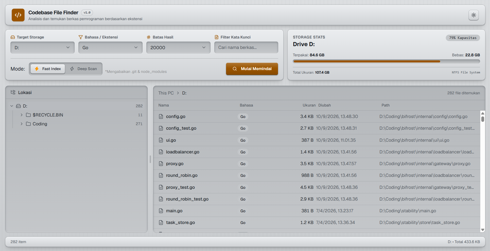

# Codebase File Finder

Aplikasi desktop untuk memindai sebuah drive dan menemukan berkas berdasarkan
bahasa pemrograman. Hasilnya dikirim secara bertahap saat pemindaian berjalan,
ditampilkan dalam pohon folder dan tabel yang divirtualisasi, sehingga tetap
responsif sampai puluhan ribu berkas.

Dibangun dengan **Wails v2**: backend Go dikompilasi menjadi binary native,
antarmuka React berjalan di WebView2, dan keduanya berkomunikasi lewat binding
yang di-generate otomatis.



---

## 1. Fungsi

### Masalah yang dipecahkan

Mencari kode yang tersebar di seluruh disk biasanya berarti menebak nama folder
atau menunggu alat pencarian umum yang menyaring berdasarkan teks di dalam berkas.
Aplikasi ini melakukan hal sebaliknya: ia menyaring berdasarkan **jenis berkas**,
jadi pertanyaan seperti "di mana saja proyek Go di drive ini?" bisa dijawab dalam
satu pemindaian.

### Fitur

- **Pemindaian per drive**, bukan per folder. Daftar drive diambil dari sistem.
- **10 bahasa siap pakai** dengan pemetaan ekstensi: JavaScript, TypeScript,
  Python, Go, Rust, Java, C#, C++, PHP, Ruby.
- **Filter kata kunci** pada nama berkas (case-insensitive).
- **Dua mode pemindaian:**
  - **Fast Index** — mengabaikan `node_modules`, `.git`, `dist`, `build`, `target`,
    `vendor`, `__pycache__`, `venv`, `.venv`, `.next`, `.cache`, `.gradle`, dan
    menghormati `.gitignore` pada root drive.
  - **Deep Scan** — tidak mengabaikan apa pun, termasuk `node_modules` dan `.git`.
    Jauh lebih lambat, jadi ada dialog konfirmasi sebelum dijalankan.
- **Batas hasil yang bisa diatur**: 1.000 / 5.000 / 20.000 / 50.000 berkas.
  Saat batas tercapai, pemindaian berhenti dan UI memberi tahu bahwa hasilnya
  terpotong, bukan diam-diam memotong.

### Cara pakai

1. Pilih **Target Storage** (drive yang mau dipindai).
2. Pilih **Bahasa / Ekstensi**, misalnya `Go (*.go)`.
3. Opsional: isi **Filter Kata Kunci** untuk menyaring nama berkas.
4. Pilih mode: **Fast Index** (harian) atau **Deep Scan** (menyeluruh).
5. Pilih **Batas Hasil**.
6. Klik **Mulai Memindai**. Tabel terisi bertahap.
7. Klik folder di panel **Lokasi** untuk mempersempit tabel ke subtree itu, atau
   **Hentikan** untuk membatalkan.

---

## 2. Unduh

| Bentuk distribusi        | Berkas hasil                                       | Perintah build      | Tautan rilis                                                                     |
| ------------------------ | -------------------------------------------------- | ------------------- | -------------------------------------------------------------------------------- |
| Portable (satu berkas)   | `programming-languages-finder.exe`                 | `wails build`       | https://drive.google.com/uc?export=download&id=17Uv48OXTVpbnR6tqWIgi5FpJ3_TJIApa |
| Installer Windows (NSIS) | `programming-languages-finder-amd64-installer.exe` | `wails build -nsis` | https://drive.google.com/uc?export=download&id=1aOVV0K7XklbTHxdJ3zrYHIt2c6e7SlCI |

---

## 3. Teknologi

### Backend

| Teknologi               | Versi      | Peran                                                         |
| ----------------------- | ---------- | ------------------------------------------------------------- |
| Go                      | 1.25.0     | Bahasa backend                                                |
| Wails                   | v2.15.0    | Jendela native, binding Go↔JS, runtime                        |
| `charlievieth/fastwalk` | v1.0.14    | Penelusuran direktori paralel; menghindari `os.Stat` berulang |
| `gobwas/glob`           | v1.0.0     | Pencocokan pola ekstensi (`*.go`, `*.ts`, …)                  |
| `sabhiram/go-gitignore` | 2021-09-23 | Parsing `.gitignore`                                          |
| `shirou/gopsutil/v3`    | v3.24.5    | Daftar partisi dan statistik pemakaian disk                   |

`filepath.Walk` sengaja tidak dipakai: ia berjalan satu utas dan memanggil
`os.Stat` untuk setiap entri. `fastwalk` memakai beberapa goroutine dan mengambil
metadata dari `DirEntry` yang sudah tersedia.

### Frontend

| Teknologi                    | Versi | Peran                                 |
| ---------------------------- | ----- | ------------------------------------- |
| React                        | 19.1  | Library UI                            |
| TypeScript                   | 5.6   | Type checking (dijalankan saat build) |
| Vite                         | 7.0   | Dev server dan bundler                |
| Tailwind CSS                 | 4.3   | Utility CSS dan token tema            |
| shadcn (`@base-ui/react`)    | 1.8   | Basis komponen UI                     |
| `@tanstack/react-virtual`    | 3.14  | Virtualisasi tabel hasil              |
| `react-resizable-panels`     | 4.12  | Panel pohon/tabel yang bisa di-resize |
| `react-router-dom`           | 7.18  | Routing (`HashRouter`)                |
| `lucide-react`               | 1.45  | Ikon                                  |
| `@fontsource-variable/geist` | 5.3   | Tipografi                             |

Tailwind v4 dipilih karena tema didefinisikan sebagai CSS variable di dalam
`@theme`, jadi seluruh komponen bisa berubah warna hanya dengan mengganti token,
tanpa menyentuh kelas di komponen.

---

## 4. Menjalankan & Membangun

### Prasyarat

- Go 1.25 atau lebih baru
- Node.js dan npm
- Wails CLI v2:
  ```bash
  go install github.com/wailsapp/wails/v2/cmd/wails@latest
  ```
- Windows: WebView2 Runtime (sudah terpasang di Windows 11 dan sebagian besar
  Windows 10)
- NSIS, hanya jika ingin membuat installer lewat `wails build -nsis`

### Perintah

```bash
# Pengembangan: hot reload frontend + dev server di http://localhost:34115
wails dev

# Build produksi (portable). Menghasilkan build/bin/programming-languages-finder.exe
wails build

# Build installer NSIS. Keluarannya juga di build/bin/
wails build -nsis

# Frontend saja
cd frontend
npm install
npm run build      # tsc && vite build
npm run dev        # Vite dev server

# Backend saja
go test ./...
go build ./...
```

> **Catatan build (penting).** `main.go` meng-embed seluruh isi `frontend/dist`,
> dan tahap _generating bindings_ berjalan **sebelum** frontend dikompilasi. Kalau
> folder itu masih kosong, `wails build` gagal lebih dulu dengan pesan
> `cannot embed directory frontend/dist: contains no embeddable files`. Jadi pada
> checkout bersih, bangun frontend dulu:
>
> ```bash
> cd frontend && npm run build && cd ..
> wails build
> ```

### Struktur project

```
programming-languages-finder/
├── main.go                  # Entry point; wails.Run dan konfigurasi jendela
├── app.go                   # Method Go yang di-bind ke frontend
├── wails.json               # Konfigurasi project Wails (nama, versi, author)
├── LICENSE                  # Lisensi MIT
├── internal/
│   ├── scanner/             # Pemindaian berkas (inti aplikasi) + test
│   └── storage/             # Statistik disk dan daftar drive
├── frontend/
│   ├── src/
│   │   ├── hooks/           # use-file-search: orkestrasi streaming
│   │   ├── pages/           # MainPage
│   │   ├── components/      # Header, Body, komponen ui
│   │   └── App.css          # Token tema dan utility material
│   └── wailsjs/             # Binding hasil generate — JANGAN diedit manual
├── build/
│   ├── bin/                 # Hasil build (gitignored)
│   └── windows/             # Ikon dan konfigurasi installer (di-track git)
└── docs/
    └── DOKUMENTASI-TEKNIS.md
```

---

## 5. Arsitektur Singkat

```
React (Header/Body) ──binding──▶ app.go ──▶ scanner.FileService   ──▶ filesystem
                                            storage.DriveService ──▶ OS disk API
        ▲                                          │
        └────── event search:batch / done ─────────┘
```

Frontend tidak memanggil HTTP. Ia memanggil fungsi Go melalui objek global
`window.go.main.App` yang disuntikkan Wails, dan menerima hasilnya lewat event.

Alur satu pemindaian:

1. Frontend membuat `searchId` lalu mendaftarkan listener event **sebelum**
   memanggil Go, supaya tidak ada batch yang terlewat.
2. `SearchFiles(root, patterns, keyword, mode, maxResults, searchId)` dijalankan.
3. Go menelusuri drive dengan `fastwalk` dan mengirim `search:batch` setiap 500
   hasil terkumpul.
4. Frontend menambahkan setiap batch ke state; tabel virtual merender ulang hanya
   baris yang terlihat. Batch dari `searchId` lama diabaikan.
5. Di akhir, Go mengirim `search:done` berisi statistik (`total`, `truncated`,
   `cancelled`), atau `search:error` bila gagal.
6. `CancelSearch(searchId)` membatalkan lewat `context.Context`.

Berkas di `frontend/wailsjs/` adalah hasil generate. Setelah mengubah signature
method di `app.go`, jalankan `wails generate module` (atau `wails dev`) untuk
menyinkronkannya.

---

## 6. Pengujian

```bash
go test ./internal/scanner/ -v
```

Yang dicakup:

- normalisasi root drive (`D:` menjadi `D:\`, kasus yang membuat pemindaian
  diam-diam membaca folder kerja alih-alih seluruh drive)
- penyaringan pola glob dengan `.gitignore` aktif dan nonaktif
- mode Deep benar-benar membaca berkas yang diabaikan mode Fast
- filter kata kunci
- kelengkapan metadata (ukuran dan waktu modifikasi)
- penolakan pola glob yang tidak valid
- pembagian batch hasil
- pemotongan saat `MaxResults` tercapai
- pembatalan lewat context

Belum ada test otomatis untuk frontend.

---

## 7. Batasan & Catatan

- **Target platform saat ini Windows.** Ada asumsi pemisah path `\` di
  pembentukan pohon folder, dan jendela memakai WebView2.
- **Batas keras 200.000 berkas** di backend. UI hanya menawarkan sampai 50.000.
- **Mode Deep bisa sangat lambat.** Pada drive sistem ia akan menembus `Windows`,
  `AppData`, dan seluruh isi `node_modules`.
- **`.gitignore` hanya dibaca dari root drive**, bukan dari setiap subfolder, jadi
  repo dengan `.gitignore` bersarang tidak sepenuhnya dihormati.
- **Kolom "Bahasa" bukan deteksi per-berkas.** Ia menampilkan bahasa yang Anda
  pilih sebagai filter, bukan hasil analisis tiap berkas.

---

## Lisensi

[MIT](LICENSE) © 2026 Shifyannn

Lisensi permisif paling dasar: siapa pun boleh memakai, menyalin, memodifikasi,
menggabungkan, menerbitkan, mendistribusikan, mensublisensikan, dan menjual salinan
perangkat lunak ini, selama notice hak cipta dan izin di atas disertakan. Perangkat
lunak diberikan "sebagaimana adanya", tanpa jaminan dalam bentuk apa pun.

Lisensi ini hanya mencakup kode di repositori ini. Dependensi pihak ketiga tunduk
pada lisensinya masing-masing.
